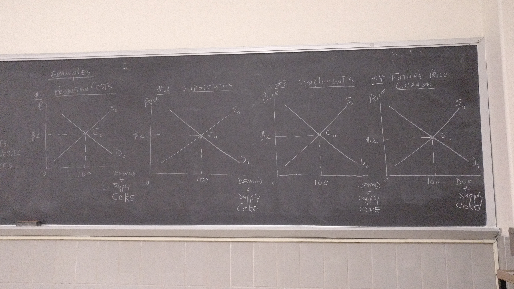

## Market Equilibrium

### Demand

- Non-price changes*
- Change in demand*
- New demand line

1. Consumers' taste
2. Consumers' income
3. Number of consumers

### Supply

- Non-price changes
- Change in supply
- New supply line

1. Change in technology
2. Change in production costs
3. Change in number of businesses
4. Change in subsidies and taxes

### Law of Demand / Law of Supply

- Price change &rarr; Change in quantity demanded (LOD) and change in quantity supplied (LOS) stay on same lines

### New Demand + Supply Lines

1. Changes in prices of substitutes + complements
2. Changes in future or expected prices

###Examples

1. Production Costs
   - If the cost of coke goes down, the supply line S~0~ moves to the right.
   - There will be a new equilibrium that shows a lower price for the product and an increase in the quantity demanded in supply.
2. Substitutes
   - Cost of pepsi goes down.
3. Complements
   - Cost of pizza goes up
   - ​